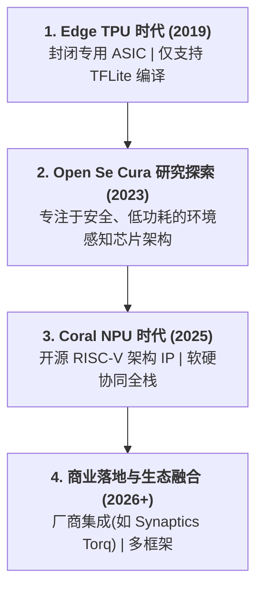
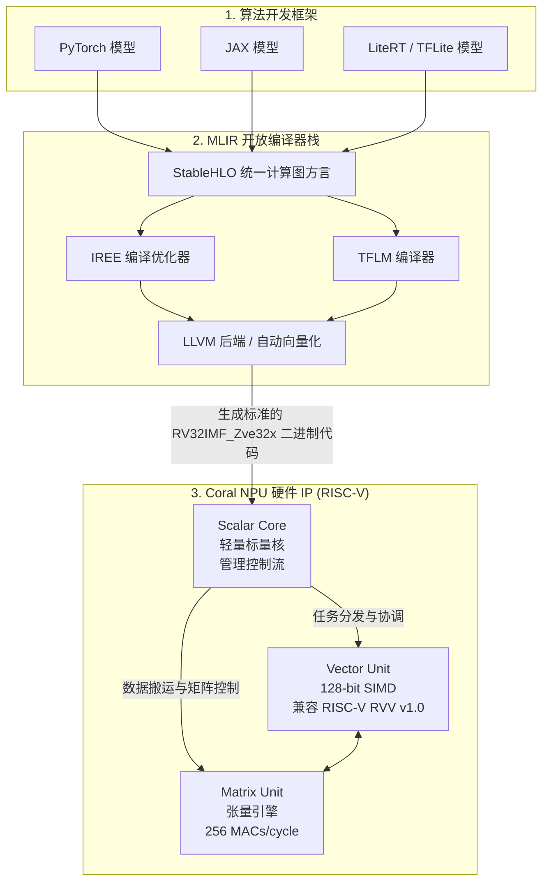

### 📈 一、 Google Edge TPU 到 Coral NPU 的发展脉络

从 **Edge TPU** 演进到 **Coral NPU**，代表了 Google 在边缘 AI（Edge AI）领域从 **“专用、封闭的加速器外设”** 向 **“通用、开放、全栈的 IP 架构”** 的重大范式转变。其演进脉络主要体现在以下四个阶段：



#### 1. 初始阶段：Edge TPU 时代 (2019年推出)
*   **产品形态**：作为专有的 ASIC（专用集成电路）外设（如 USB 加速棒、M.2 模块）或集成在第一代 Coral 开发板上。
*   **架构特征**：采用收缩阵列（Systolic Array）架构，专为 **INT8 量化模型** 的矩阵乘法设计。
*   **痛点**：
    *   **严重碎片化与生态锁死**：硬件被绑定在 **TensorFlow Lite (现 LiteRT)** 生态中，不支持 PyTorch 或 JAX。
    *   **工具链封闭**：必须使用闭源的专用编译器 `edgetpu_compiler`，无法直接编写自定义 C/C++ 算子。

#### 2. 过渡阶段：Open Se Cura 项目 (2023年)
*   谷歌研究团队（Google Research）启动了名为 **Open Se Cura** 的安全、低功耗开源系统项目。在该项目中，团队开始尝试基于 RISC-V 开源指令集，设计一套安全（结合 CHERI 安全技术）且能“始终在线”（Always-on）环境感知的 AI 处理器原型。

#### 3. 蜕变阶段：全新 Coral NPU 时代 (2025年 10 月发布)
*   Google 联合 Google Research 和 Google DeepMind，正式发布了**全新的开源、全栈式 "Coral NPU" 架构 IP**。
*   **架构本质**：全新 Coral NPU 的实质是一个**“张量/矩阵计算增强型的 RISC-V 核心 (Tensor-Enhanced RISC-V Core)”**。
*   **三层融合硬件结构**：
    ```
    +-----------------------------------------------------------------------+
    |                       Coral NPU Core (IP 核心)                         |
    |                                                                       |
    |  1. 标量前端 (Scalar Core)  : RV32IMF 标量核 (负责控制流、C 程序运行)     |
    |  2. 向量单元 (Vector Unit)  : 128-bit SIMD (支持 RISC-V RVV 1.0 指令集)  |
    |  3. 张量引擎 (Matrix Unit)  : 256 MACs/cycle 矩阵计算引擎 (核心算力)     |
    +-----------------------------------------------------------------------+
    ```
*   **设计范式革命（ML-First）**：
    *   **硬件开源**：不再是售卖固定的芯片，而是提供**基于 RISC-V ISA 的开源硬件 IP 模块**，供半导体厂商直接集成到智能穿戴（AR眼镜、智能手表、Hearables）的 SoC（系统级芯片）中。
    *   **颠覆传统架构**：传统范式是“CPU 主控 + 外挂加速器外设”；Coral NPU 颠覆了“先设计 CPU 标量，再塞入向量，最后加 NPU”的思路，直接将**矩阵乘法（Matrix Engine）作为核心最底层**，并与 RISC-V 标量、向量单元深度融合，实现控制与计算在 NPU 内部的高效闭环。

#### 4. 生态落地阶段 (2026年至今)
*   主流芯片厂商开始深度集成 Coral NPU。例如 **Synaptics（新思）推出的 Astra Torq NPU 平台** 便是基于开源的 Google Coral NPU 打造，加速了多模态轻量级大语言模型（LLMs）和环境感知 AI 在物联网（IoT）端侧的落地。

---

### 🛠️ 二、 Google Coral NPU 架构驱动/软件层面情况

Coral NPU 的软件栈彻底抛弃了过去的“黑盒编译器”模式，全面转向了**现代、开源、基于标准编译器技术**的开放生态。

#### 1. 软件栈架构层级

*   **前端（Frameworks）**：原生支持 **PyTorch、JAX** 和 **LiteRT (TensorFlow Lite)**，开发者无需繁琐的专有格式转换。
*   **编译器中台（Compiler Infrastructure）**：
    *   利用 LLVM 项目中的 **MLIR (Multi-Level Intermediate Representation)** 进行多层渐进式优化。
    *   使用 **StableHLO** 作为统一的计算图方言（Dialect）。
    *   采用 **IREE** (Intermediate Representation Execution Environment) 实现自动多维编译和 LLVM 自动向量化。
*   **后端与运行时（Runtime / Micro-kernels）**：
    *   **LiteRT for Microcontrollers (TFLM)**：面向单片机等极低内存（数 KB 级别）环境的轻量级运行时。
    *   **C-Programmable**：整个 NPU 本质上是一个 C 语言可编程的目标平台。官方提供由手写汇编/模板优化的 **Math 算子库** 供编译器直接调用。

#### 2. 硬件层级的 ISA 驱动支持
Coral NPU 采用 32位 开放指令集架构（ISA）：**RV32IMF_Zve32x**：
*   **I / M / F**：支持基础整型、乘除法和单精度浮点运算。
*   **V / Zve32x**：兼容标准的 RISC-V 向量扩展（v1.0），这使得编译器可以直接使用标准的 RISC-V GCC/Clang 链生成高性能向量代码，不再需要专有驱动来分发硬编码的指令包。

#### 3. 深入解析 Coral NPU 的“C/C++ 原生可编程性” (C-Programmable)

传统 NPU（如第一代 Edge TPU、高通 Hexagon DSP 或各类固定功能脉动阵列）通常是 **“不可直接用 C 编程的黑盒加速器”**，开发者无法向 NPU 内部直接发送 C/C++ 二进制程序，只能依赖专有编译器生成硬编码的硬件指令包。

Coral NPU 实现了真正的 **“C/C++ 原生可编程”**，其背后的硬核支撑力源于以下 4 个关键维度：

1. **硬件层面：内嵌完整的 RISC-V CPU 标量前端 (Scalar Core)**
   * Coral NPU 核心内部并非单纯的矩阵乘法网格，而是直接集成了一个 **RV32IMF 开源 RISC-V 控制核**。
   * 该标量核具备标准的程序计数器 (PC)、寄存器组、控制流与中断响应能力，能够像普通微控制器（MCU）一样运行完整的 C 语言运行时（C Runtime / Bare-metal Environment）。

2. **工具链层面：通用标准的 GCC / Clang / LLVM 编译链**
   * 开发者可以直接使用通用的 **`riscv32-unknown-elf-gcc`** 或 **`clang`** 编译器，将标准 C/C++ 源码（如 `float`, `int`, 循环, 递归, 指针操作）直接编译为运行在 NPU 标量核上的标准 **ELF 可执行二进制**。

3. **算子加速层面：标准的 RISC-V Vector (RVV 1.0) Intrinsics**
   * 当开发者需要编写自定义算子（如特殊激活函数 GELU、Swish 或自定义 Attention 掩码）时，无需学习复杂的专有汇编，直接使用标准的 C/C++ 向量本征函数（Vector Intrinsics，定义于 `<riscv_vector.h>`）：
     ```cpp
     // 示例：使用 C++ + RVV Intrinsics 编写向量加法算子
     #include <riscv_vector.h>
     void custom_add(const float* a, const float* b, float* c, size_t n) {
         for (size_t vl; n > 0; n -= vl, a += vl, b += vl, c += vl) {
             vl = __riscv_vsetvl_e32m1(n);
             vfloat32m1_t va = __riscv_vle32_v_f32m1(a, vl);
             vfloat32m1_t vb = __riscv_vle32_v_f32m1(b, vl);
             vfloat32m1_t vc = __riscv_vfadd_vv_f32m1(va, vb, vl);
             __riscv_vse32_v_f32m1(c, vc, vl);
         }
     }
     ```
   * 编译后的向量二进制指令直接由 NPU 内置的 **128-bit Vector Unit** 执行。

4. **运行机制层面：NPU 内部闭环解决未支持算子（Zero Bus Overhead）**
   * 在传统 NPU 上，不支持的算子会通过 PCIe/USB 总线强制退回宿主 CPU 执行，造成巨大的数据传输与上下文切换开销。
   * 在 Coral NPU 上，MLIR 编译器直接将未支持的自定义算子降级为 C/C++ 指令并编译进 NPU 二进制，由 NPU 内置的 RISC-V 标量/向量核**在 NPU 内部原地执行**，做到真正零跨片开销。

---

### ❓ 三、 能支持其他移动端/边缘端计算库吗？

❌ **不支持原生的 OpenCL、Vulkan Compute 或厂商专有 SDK（如 QNN、NeuroPilot）。**

#### 1. 常见移动端/边缘端计算库概览

在移动端和端侧 AI 领域，常见的计算库与加速框架主要包括：

* **GPGPU 与跨平台计算 API**：
  * **OpenCL / Vulkan Compute**：跨平台通用并行计算 API。Vulkan Compute 是 Android 平台当前推荐的 low-overhead GPGPU 计算标准。
  * **Apple Metal / MPS**：Apple 平台的低级图形/计算 API 及神经网络算子库 (Metal Performance Shaders)。
* **CPU 向量加速与底层算子库**：
  * **Arm Compute Library (ACL)**：专为 Arm CPU（NEON/SVE）与 Mali GPU 打造的高性能 C++ 算子库。
  * **Google Highway**：跨平台 C++ SIMD 向量化抽象库（支持 NEON, RISC-V RVV, AVX 等）。
* **芯片厂商专用 NPU/DSP SDK**：
  * **Qualcomm QNN / SNPE**（高通 Hexagon HTP）、**MediaTek NeuroPilot**（联发科 APU）、**Apple Core ML / ANE**（苹果 Neural Engine）。
* **系统级 API**：
  * **Android NNAPI**：Android 系统的神经网络底层硬件抽象层。

#### 2. 为什么 Coral NPU 不支持/不需要这些库？

1. **架构定位不同（DSA vs. GPGPU）**：
   OpenCL、Vulkan Compute 和 Metal 是针对 GPU 的 SIMT（单指令多线程）并行计算设计的。而 Coral NPU 属于**领域特定架构（DSA）**，针对深度学习张量与矩阵乘法进行了极致优化，不具备运行通用 GPGPU 核函数的硬件环境。
2. **无需厂商封闭 SDK**：
   高通 QNN、联发科 NeuroPilot 等 SDK 是各自闭源 NPU 的驱动与工具链。Coral NPU 是**基于开源 RISC-V ISA (RV32IMF_Zve32x) 的硬件 IP**，完全拥抱开放生态，不再需要绑定任何厂商的专用驱动。
3. **更优的原生替代——C++ 与 RISC-V Vector (RVV) 原生编程**：
   传统 NPU 若遇到不支持的算子，开发者往往需要编写 OpenCL 或平台专用代码。而 Coral NPU **本身即是一个完整的 RISC-V 处理器**：
   * 开发者若需扩展自定义算子，可以直接编写 **标准 C++**，并利用 **RISC-V Vector (RVV v1.0) Intrinsics** 进行加速。
   * 由开源 MLIR / IREE / LLVM 编译器直接编译生成二进制代码，无需经过 OpenCL 或专有 SDK 转换，性能更高且极低延迟。

#### 3. 核心结论：商业与生态战略决策 vs. 技术可行性

必须强调的是：**Coral NPU 不原生支持 OpenCL / Vulkan Compute，完全是一个商业与生态战略决策（Commercial/Strategic Decision），而非技术可行性限制（Technical Limitation）。**

* **技术可行性（Technical Feasibility）**：
  Coral NPU 硬件上集成了标准的 `RV32IMF` RISC-V 标量核与 128-bit `RVV 1.0` 向量单元。从技术实现路径来看，为其编写 OpenCL / Vulkan 驱动并把 SPIR-V 翻译为 RISC-V 向量指令在硬件上运行是完全可行的。
* **商业与生态战略考量（Commercial & Strategic Rationale）**：
  1. **打破 GPU 厂商的 API 捆绑与生态护城河**：OpenCL / Vulkan 计算生态的主导权由传统 GPU 厂商掌控。Google 战略性地放弃 OpenCL，旨在将端侧 AI 编译与运行时主导权收回至由 Google 主导的开源体系（`MLIR ➔ StableHLO ➔ IREE`）。
  2. **避免 GPGPU 抽象层带来的性能与功耗浪费**：OpenCL / Vulkan 是为 GPU 的 SIMT（单指令多线程）模型设计的。在面向 Wearables / IoT 的领域特定架构（DSA）上引入庞大的 GPGPU 驱动和线程抽象，会产生显著的内存与功耗开销。
  3. **提供更高效的原生替代方案**：通过暴露标准的 RISC-V C/C++ 编程与 `<riscv_vector.h>` Intrinsics，开发者能以更直接、低延迟的原生方式扩展自定义算子，无需依赖 OpenCL 转换。

---

### 🔄 四、 LiteRT (TensorFlow Lite) 支持情况

**是的，Coral NPU 完美支持 LiteRT！**

> **名词澄清**：**LiteRT** 是 Google 在 2024 年末对经典的 TensorFlow Lite (TFLite) 平台进行的**正式品牌升级与重命名**，专为端侧和生成式 AI 优化。

与初代 Edge TPU 相比，Coral NPU 对 LiteRT 的支持发生了质的飞跃：

| 特性 | 第一代 Edge TPU | 最新一代 Coral NPU |
| :--- | :--- | :--- |
| **支持的框架** | **仅限** TensorFlow Lite (TFLite) | **LiteRT**、**PyTorch**、**JAX** |
| **运行时库** | 专有的 Edge TPU Runtime | **LiteRT for Microcontrollers (TFLM)** / IREE |
| **算子不支持时** | 退回到宿主 CPU，产生高昂的 PCIe/USB 传输和上下文切换开销 | 在 NPU 内部的 RISC-V 标量/向量核上直接执行 C/C++ 备用算子，**无跨片传输开销** |
| **编译机制** | 离线黑盒 `edgetpu_compiler` 静态编译 | 基于 MLIR & StableHLO 动态降级编译 |

---

### 📐 五、 架构对比与工作流图

以下为您绘制两张图：
1. **第一张图（Mermaid）：** 详细展示 **Coral NPU 的硬件与软件栈架构（从模型到硅片）**。
2. **第二张图（ASCII对比图）：** 直观对比 **Edge TPU 工作流** 与 **Coral NPU 工作流**。

#### 1. Coral NPU 全栈架构图 (Mermaid)



#### 2. 工作流演进对比图 (ASCII)

```
========================= 【 1. 传统 Edge TPU 工作流 】 =========================

  [ TFLite 模型 ] ---> ( 闭源 edgetpu_compiler ) ---> [ 专用硬编码指令包 (.tflite) ]
                                                            |
                                                            v
                                            +-------------------------------+
                                            |   USB / PCIe / 专用驱动       |
                                            +-------------------------------+
                                                            |
                                                            v
                     +--------------------------------------------------------------+
                     | 硬件：[宿主 CPU] <===高速总线通信===> [固定的 Matrix 乘法 ASIC] |
                     | （一旦遇到不支持的算子，必须通过总线退回给 CPU，造成延迟瓶颈）|
                     +--------------------------------------------------------------+


========================= 【 2. 全新 Coral NPU 工作流 】 =========================

  [ PyTorch / JAX / LiteRT ]
             |
             v
  [ MLIR / StableHLO ] ---> ( IREE / LLVM 编译器 ) ---> [ 标准 RISC-V 机器码 (ELF) ]
                                                                 |
                                                                 v
                                                +-----------------------------------+
                                                |       标准内核 / 总线驱动         |
                                                +-----------------------------------+
                                                                 |
                                                                 v
                       +------------------------------------------------------------+
                       | 硬件：[ Coral NPU Core ]                                   |
                       |       +--------------------------------------------+       |
                       |       | [ 标量前端 (CPU) ]                         |       |
                       |       |      |                                     |       |
                       |       |      v                                     |       |
                       |       | [ 向量单元 (SIMD) ] <===> [ 矩阵计算单元 ] |       |
                       |       | （所有算子全自研，在 NPU 内部闭环解决，极低功耗）    |
                       |       +--------------------------------------------+       |
                       +------------------------------------------------------------+
```

---

### 💰 六、 商业模式分析：开源 IP 与软件栈下，Google 如何获利？

Google 将 Coral NPU 硬件 IP（基于 RISC-V）和完整软件栈（LiteRT / StableHLO / IREE）完全开源，表面上放弃了传统芯片卖硬件或闭源 IP 授权费的直接收益，但实际上这是典型的 **“去碎片化以构建端侧生态，带动作业系统、云端与模型服务”** 的平台型策略。其核心商业变现与战略收益逻辑如下：

#### 1. 打造“端侧 AI 的 Android”——锁定 Gemma / Gemini 与 LiteRT 生态
* **消除硬件碎片化**：传统端侧 AI 严重碎片化（高通 QNN、联发科 NeuroPilot、苹果 Core ML 相互割裂）。Google 提供免费且高性能的通用 NPU IP，吸引半导体厂商（如 Synaptics）直接集成。
* **锁定开发者生态**：硬件普及带动手持设备、智能穿戴和 IoT 芯片原生支持 **LiteRT、Gemma、Gemini Nano** 等 Google 模型，确保 Google 在端侧 AI 开发框架中的主导地位，防止开发者流失至竞争对手（如 Meta ExecuTorch）。

#### 2. 端云协同（Hybrid AI）带动 Google Cloud 与 API 收入
* **端云无缝接轨**：Coral NPU 专注于端侧 Always-on 极低功耗感知（如语音唤醒、微视觉、端侧轻量 Gemma 推理）。当遇到超复杂推理时，系统通过 LiteRT 框架无缝将请求分发至 **Google Cloud (Vertex AI) / Gemini API**，直接带来源源不断的云端算力与 API 订阅收入。
* **赋能 Android & Wear OS 系统生态**：极低功耗的 Coral NPU IP 可直接集成至智能手表（Wear OS）、AR 眼镜、Hearables、Nest 智能家居中，显著提升 Google 操作系统生态的 AI 竞争力。

#### 3. 降低自有硬件（Pixel / Nest / Fitbit）的研发与 IP 授权成本
* **摆脱第三方 IP 版税锁死**：Google 自身的硬件产品线（Pixel 手机/手表、Nest 智能家居、Fitbit 穿戴设备）集成 Coral NPU IP，无需向传统芯片 IP 巨头支付高昂的专利许可费与按颗版税（Royalties）。
* **软硬一体化快速迭代**：自有硬件与开源生态共享同一套基于 MLIR / StableHLO 的编译器栈，算法从 Research 到终端落地的周期大幅缩短。

#### 4. B端商业模组、开发套件与企业级支持
* **Coral 硬件模组销售**：Google 官方及授权渠道继续销售 Coral SOM (System-on-Module)、Dev Board 开发板及工业级 PCIe/M.2 模组，直接获取硬件销售毛利。
* **企业级服务与安全认证**：面向有高安全/定制化需求的芯片厂商，提供安全架构（Open Se Cura / CHERI 结合）、特定加速算子库定制以及企业级 LTS 维护支持服务。

---

### 💡 总结与建议
*   **总结**：从 Edge TPU 升级到 Coral NPU 是一次**去碎片化（Anti-fragmentation）**的巨大进步。借助 RISC-V 开放生态，它打破了只能用 Google 专有软件链的僵局。
*   **开发建议**：如果您目前正在为下一代智能穿戴或超低功耗边缘端开发，无需考虑如何配置 OpenCL，直接使用 **LiteRT (TFLM) 或 IREE + PyTorch/JAX** 并在标准 C++ 环境下开发自定义算子，即可发挥 Coral NPU 的最强实力。
