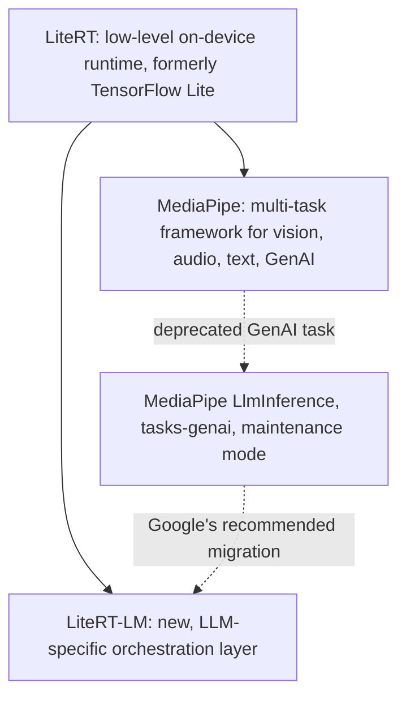

# MediaPipe LLM Inference vs. LiteRT-LM: Pros, Cons, and Recommendations

_Last updated: 2026-07-21_

This document summarizes what we learned first-hand while building an on-device
Gemma chat demo for Android, comparing Google's two on-device LLM serving
stacks: the legacy **MediaPipe LLM Inference API** (`com.google.mediapipe:tasks-genai`,
classes `LlmInference` / `LlmInferenceSession`) and its designated successor,
**LiteRT-LM** (`com.google.ai.edge.litertlm`).

## TL;DR

- **MediaPipe is not being discontinued.** It remains an actively developed
  framework for vision, audio, and text tasks (object detection, pose/hand
  landmarkers, segmentation, embedders, etc.).
- **Only the LLM Inference task within MediaPipe is deprecated** (marked
  `@Deprecated` in source, "maintenance-only" in docs). Google explicitly
  recommends migrating to LiteRT-LM for new GenAI work.
- **New model releases (e.g. Gemma 4, all sizes) ship only for LiteRT-LM**
  (`.litertlm` format). No `.task` bundle exists for them, and building one
  yourself is technically very difficult (see below).
- If you need to keep using the classic MediaPipe API, older models
  (Gemma 2B/3 1B and similar generations) still have real `.task` bundles
  available, e.g. on Hugging Face's `litert-community` org.

## How are MediaPipe and LiteRT-LM related?

A natural question is whether one is built on top of the other. It is
neither — they are siblings that both sit on top of the same shared
low-level runtime, LiteRT (the rebranded TensorFlow Lite):

- **LiteRT** is the shared low-level runtime that actually executes model
  graphs on CPU/GPU/NPU.
- **MediaPipe** is a broader, older framework (graphs of "calculators") that
  uses LiteRT under the hood to run models for many task types: vision,
  audio, text, and (until it was deprecated) GenAI/LLMs.
- **LiteRT-LM** is a separate, newer, purpose-built orchestration layer built
  directly on top of LiteRT, not on top of MediaPipe. It adds LLM-specific
  plumbing (KV-cache management, prompt templating, tool/function calling,
  speculative decoding) that MediaPipe's calculator-graph model was not
  designed for.

So MediaPipe's (deprecated) LlmInference task and LiteRT-LM are two
independent, parallel consumers of the same underlying LiteRT runtime.
LiteRT-LM was built to replace MediaPipe's GenAI task, not to extend it or
sit underneath it. MediaPipe as a whole (its non-GenAI tasks) is unaffected
and does not depend on LiteRT-LM at all.

## Background: two different container formats

| | MediaPipe `.task` | LiteRT-LM `.litertlm` |
|---|---|---|
| Container | ZIP archive (may have a few leading padding bytes before the ZIP signature) | Custom binary container: 8-byte magic `"LITERTLM"` + version + flatbuffer header + block-aligned sections |
| Structure (real example we inspected) | Exactly 3 fixed entries: `TF_LITE_PREFILL_DECODE` (merged prefill+decode TFLite graph), `TOKENIZER_MODEL` (SentencePiece), `METADATA` (small proto) | Arbitrary list of typed sections: `TFLiteModel` (with `model_type`: `embedder`/`prefill_decode`/`prefill`/`decode`/drafter, etc.), `SP_Tokenizer`, `HF_Tokenizer`, `LlmMetadata` proto, embedding metadata, system metadata (uuid, timestamp), and more |
| Extensibility | Rigid — one model, one tokenizer, minimal metadata | Designed to be extensible — multiple models (e.g. speculative-decoding drafter models, vision/audio encoders), multiple tokenizer types, richer metadata |
| Tooling | `mediapipe.tasks.python.genai.bundler` (Python, older) | Official `litert-lm-builder` PyPI package with CLIs (`litert-lm-builder`, `litert-lm-peek`) to build/inspect/unpack `.litertlm` files |
| Detection at runtime | ZIP signature `PK\x03\x04` (may be offset a few bytes into the file) | Magic string `LITERTLM` at byte 0 |

## MediaPipe LLM Inference API (`tasks-genai`)

### Pros

- **Simple, small API surface.** `LlmInference.createFromOptions()` +
  `LlmInferenceSession` (`addQueryChunk()` / `generateResponseAsync()`) is easy
  to learn and integrate quickly.
- **Still published and functional.** The latest release (0.10.35, April
  2026) works fine for models that target it; it's not broken, just frozen in
  scope.
- **Broad backward compatibility** with models converted years ago (Gemma 1/2,
  Phi-2, and Gemma 3 1B/2B-class models still have `.task` bundles from the
  `litert-community` org).
- **Lower integration overhead for existing MediaPipe apps** — if your app
  already uses MediaPipe for vision/audio tasks, staying in one framework
  avoids adding a second dependency/runtime.
- Supports LoRA adapters (`.task`-format base model only, GPU backend only).

### Cons

- **Deprecated and in maintenance mode.** No new features, and — critically —
  **no new model support**. All classes are marked `@Deprecated` in the
  MediaPipe source with an explicit pointer to LiteRT-LM.
- **No path to newer model generations.** Gemma 4 (all sizes: E2B, E4B, 12B,
  26B-A4B MoE, 31B) ships only as `.litertlm`. There is no official `.task`
  bundle for Gemma 4, and none is planned.
- **Implicit-session context bug risk.** The convenience methods
  (`LlmInference.generateResponse(String)` /
  `generateResponseAsync(String, ...)`) silently reset their "implicit
  session" — and therefore conversation context — on every call. You must use
  `LlmInferenceSession` explicitly and keep it alive across turns to get
  multi-turn context (a real bug we hit and fixed in this project).
- **Rigid container format** limits what a model can express (single merged
  TFLite graph, one tokenizer, minimal metadata) — no room for speculative
  decoding drafters, multi-modal encoders, or richer capability metadata.
- **No official interoperability with `.litertlm`.** MediaPipe's own model
  format detector treats `.task` (ZIP) and `.litertlm` as entirely distinct,
  unrelated formats — there's no supported converter between them, and even a
  self-built one is likely to hit unsupported-op errors, because the
  underlying C++ calculators were effectively frozen at the same time the API
  was deprecated. Newer models may rely on ops/graph structures the legacy
  engine's calculators don't have.

## LiteRT-LM

### Pros

- **Actively developed, fast-moving.** 26+ GitHub releases, v0.7 → v0.14 in
  about a year: NPU acceleration, multi-modality, tool/function calling,
  multi-token prediction (speculative decoding) for ~3x faster decode, new
  Swift/JavaScript/Flutter APIs, an OpenAI-API-compatible CLI server.
- **This is where all new models land**, including Gemma 4, Gemma 3n, and
  third-party families (Llama, Phi-4, Qwen, and more).
- **Richer, extensible container format** (`.litertlm`) that can bundle
  multiple models/tokenizers/capabilities in one file, with official tooling
  (`litert-lm-builder`, `litert-lm-peek`) to build and inspect them.
- **Cross-platform parity**: Android/JVM (stable Kotlin API), iOS/macOS
  (Swift), Web (JavaScript), Flutter (community), C++ (stable), Python
  (stable) — one runtime, many platforms.
- **Production-proven** — reportedly powers on-device GenAI in Chrome,
  Chromebook Plus, and Pixel Watch.
- **Richer conversation API**: built-in `Conversation`/`Message` abstractions,
  system instructions, sampler configs, and structured tool-calling — more
  ergonomic than manually managing prompt concatenation.
- **Device-specific compiled variants** are published for many models (e.g.
  Google Tensor G5, various Qualcomm/Intel chips) for better performance,
  alongside a generic variant that works everywhere.

### Cons

- **Newer dependency, less battle-tested in the wild** compared to
  MediaPipe's multi-year track record, though it's already shipping in major
  Google products.
- **Not source/format compatible with MediaPipe.** Migrating an existing
  MediaPipe-based app requires a real rewrite of the inference-calling code
  (different Gradle dependency, different Kotlin API shapes, different model
  files to host/download) — not just swapping a URL.
- **Larger/varied model files.** `.litertlm` files we found for Gemma 4 E2B
  ranged from ~2GB (generic/web) to ~3.3GB (NPU-specific variants) — bigger
  downloads than the more compact single-quantization `.task` files for
  smaller legacy models.
- **Some platform APIs are early preview** (Swift, JavaScript, Flutter is
  community-maintained) — only Kotlin/Android, Python, and C++ are marked
  fully stable as of this writing.
- **Some gated/licensed models require authentication** to download (e.g.
  Gemma requires accepting a license on Hugging Face), same as with
  MediaPipe-era models — not a LiteRT-LM-specific downside, but still a
  practical hurdle.

## Recommendation

- **For a new project, or if you want access to the latest models (Gemma 4
  and beyond):** use **LiteRT-LM**. It's where Google's engineering investment
  and new model releases are going.
- **For an existing MediaPipe-based app that only needs older/smaller models**
  (e.g. Gemma 3 1B-IT, which we've verified works well): staying on MediaPipe
  `tasks-genai` is a reasonable, lower-effort choice, as long as you're aware
  it won't gain new models or features.
- **A hybrid app** (offering multiple model choices, some on each stack) is
  possible but means carrying two dependencies/runtimes and two different
  inference code paths — worth it only if you specifically need both an
  already-integrated legacy model and a newer one.

## References

- MediaPipe LLM Inference (Android): https://developers.google.com/edge/mediapipe/solutions/genai/llm_inference/android
- LiteRT-LM (Android/Kotlin): https://developers.google.com/edge/litert-lm/android
- LiteRT-LM GitHub: https://github.com/google-ai-edge/LiteRT-LM
- LiteRT-LM File Builder (`.litertlm` format & tooling): https://developers.google.com/edge/litert-lm/file_builder
- Hugging Face `litert-community` org (pre-built models for both stacks): https://huggingface.co/litert-community
