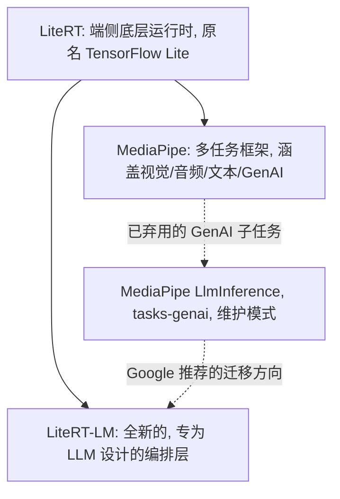

# MediaPipe LLM Inference 与 LiteRT-LM 对比：优缺点与建议

_最后更新：2026-07-21_

本文总结了我们在为 Android 构建端侧 Gemma 聊天演示应用过程中,对 Google
两套端侧大模型（LLM）推理方案的第一手对比经验：传统的 **MediaPipe LLM
Inference API**（`com.google.mediapipe:tasks-genai`，核心类
`LlmInference` / `LlmInferenceSession`）以及其官方指定的后继方案
**LiteRT-LM**（`com.google.ai.edge.litertlm`）。

## 一句话总结

- **MediaPipe 整体并未被放弃。** 它仍是一个在视觉、音频、文本等任务上持续
  维护的框架（目标检测、姿态/手部关键点、图像分割等功能均在积极开发中）。
- **仅有 MediaPipe 中的 LLM Inference 这一子任务被标记为弃用**（源码中标注
  `@Deprecated`，官方文档标注为"仅维护模式"）。Google 明确建议新的 GenAI
  开发迁移到 LiteRT-LM。
- **新发布的模型（例如 Gemma 4，所有尺寸）仅提供 LiteRT-LM 格式**
  （`.litertlm`）。官方没有为 Gemma 4 提供 `.task` 格式包，也没有计划提供。
  自行转换在技术上也非常困难（详见下文）。
- 如果你必须继续使用传统的 MediaPipe API，较早的模型（Gemma 2B/3 1B 等）
  仍有真实可用的 `.task` 格式包，例如可在 Hugging Face 的
  `litert-community` 组织下找到。

## MediaPipe 和 LiteRT-LM 是什么关系？

一个自然会产生的问题是：两者之间是否存在“基于”关系（谁构建在谁之上）？
答案是都不是——它们其实是“兄弟关系”，都构建在同一个共享的底层运行时
LiteRT（即改名后的 TensorFlow Lite）之上：

- **LiteRT** 是共享的底层运行时，负责在 CPU/GPU/NPU 上真正执行模型图。
- **MediaPipe** 是一个更宽泛、历史更久的框架（由一系列“calculator”组成的
  图），它在内部通过 LiteRT 来运行各类任务的模型：视觉、音频、文本，
  以及（在被弃用之前的）GenAI/LLM。
- **LiteRT-LM** 是一个独立的、更新的、专为 LLM 设计的编排层，直接构建在
  LiteRT 之上，而不是构建在 MediaPipe 之上。它添加了 LLM 专属的基础设施
  （KV 缓存管理、prompt 模板、工具/函数调用、推测解码），这些是 MediaPipe
  基于 calculator 图的模型设计中并未考虑到的。

因此，MediaPipe 中（已弃用的）LlmInference 子任务和 LiteRT-LM，其实是
同一个底层 LiteRT 运行时的两个独立、并行的使用者——LiteRT-LM 的设计目的是
取代 MediaPipe 的 GenAI 子任务，而不是在其基础上扩展或位于其下层。
MediaPipe 整体（其非 GenAI 的其他任务）并不受影响，也完全不依赖
LiteRT-LM。

## 背景：两种不同的容器格式

| | MediaPipe `.task` | LiteRT-LM `.litertlm` |
|---|---|---|
| 容器类型 | ZIP 压缩包（ZIP 签名前可能有少量填充字节） | 自定义二进制容器：8 字节魔数 `"LITERTLM"` + 版本号 + flatbuffer 头部 + 按块对齐的多个数据段 |
| 结构（我们实际检查到的真实示例） | 固定 3 个条目：`TF_LITE_PREFILL_DECODE`（合并了 prefill+decode 的 TFLite 图）、`TOKENIZER_MODEL`（SentencePiece 分词器）、`METADATA`（很小的 proto 元数据） | 任意数量的分类数据段：`TFLiteModel`（含 `model_type`：`embedder`/`prefill_decode`/`prefill`/`decode`/草稿模型 等）、`SP_Tokenizer`、`HF_Tokenizer`、`LlmMetadata` proto、embedding 元数据、系统元数据（uuid、时间戳）等 |
| 可扩展性 | 结构固定——一个模型、一个分词器、极少元数据 | 专为可扩展设计——可容纳多个模型（例如用于推测解码的草稿模型、视觉/音频编码器）、多种分词器类型、更丰富的元数据 |
| 工具链 | `mediapipe.tasks.python.genai.bundler`（较旧的 Python 工具） | 官方 PyPI 包 `litert-lm-builder`，提供命令行工具（`litert-lm-builder`、`litert-lm-peek`）用于构建/查看/解包 `.litertlm` 文件 |
| 运行时识别方式 | ZIP 签名 `PK\x03\x04`（文件中的偏移量可能不是 0） | 文件起始处的魔数字符串 `LITERTLM` |

## MediaPipe LLM Inference API（`tasks-genai`）

### 优点

- **API 简单、体积小。** `LlmInference.createFromOptions()` 搭配
  `LlmInferenceSession`（`addQueryChunk()` / `generateResponseAsync()`）
  易学易用，可快速集成。
- **仍在正常发布和维护可用。** 最新版本（0.10.35，2026 年 4 月）对于
  目标模型运行良好；并非"损坏"，只是功能范围被冻结。
- **对多年前转换的模型有广泛的向后兼容性**（Gemma 1/2、Phi-2，以及
  Gemma 3 1B/2B 级别的模型仍可在 `litert-community` 组织下找到
  `.task` 格式包）。
- **对已有 MediaPipe 应用的集成成本更低**——如果你的应用已经在用
  MediaPipe 做视觉/音频任务，继续使用同一框架可以避免引入第二套
  依赖/运行时。
- 支持 LoRA 适配器（仅限 `.task` 格式的基础模型，且仅支持 GPU 后端）。

### 缺点

- **已被弃用，处于维护模式。** 不会有新功能，更关键的是——**不会支持新
  模型**。所有相关类在 MediaPipe 源码中都标注了 `@Deprecated`，并明确
  指向 LiteRT-LM。
- **无法使用更新的模型代际。** Gemma 4（包括 E2B、E4B、12B、
  26B-A4B MoE、31B 所有尺寸）仅以 `.litertlm` 格式发布。官方没有为
  Gemma 4 提供 `.task` 格式包，也没有相关计划。
- **隐式 Session 的上下文丢失风险。** 便捷方法
  （`LlmInference.generateResponse(String)` /
  `generateResponseAsync(String, ...)`）会在**每次调用时**静默重置其
  "隐式 session"，从而丢失对话上下文。必须显式创建并持续复用同一个
  `LlmInferenceSession` 对象才能维持多轮对话上下文（这是我们在本项目中
  实际遇到并修复的一个真实 bug）。
- **容器格式僵化**，限制了模型可表达的内容（单一合并 TFLite 图、单一
  分词器、极少元数据）——无法容纳推测解码草稿模型、多模态编码器，或更
  丰富的能力元数据。
- **与 `.litertlm` 无官方互通性。** MediaPipe 自身的模型格式检测逻辑将
  `.task`（ZIP）与 `.litertlm` 视为完全独立、互不相关的格式——没有官方
  支持的转换工具；即便自行编写转换工具，也很可能遇到"不支持的算子"
  错误，因为底层 C++ calculator 在该 API 被弃用的同时基本被冻结了。
  更新的模型可能依赖旧引擎 calculator 中并不存在的算子/图结构。

## LiteRT-LM

### 优点

- **持续积极开发、迭代迅速。** 一年内发布了 26+ 个 GitHub 版本，从
  v0.7 迭代到 v0.14：NPU 加速、多模态支持、工具/函数调用、多 token
  预测（推测解码，解码速度提升约 3 倍）、全新的 Swift/JavaScript/Flutter
  API，以及兼容 OpenAI API 的 CLI 服务端。
- **这是所有新模型的落地平台**，包括 Gemma 4、Gemma 3n，以及第三方
  模型系列（Llama、Phi-4、Qwen 等）。
- **更丰富、可扩展的容器格式**（`.litertlm`），可在单个文件中打包多个
  模型/分词器/能力配置，并配有官方工具链（`litert-lm-builder`、
  `litert-lm-peek`）用于构建和查看。
- **跨平台一致性**：Android/JVM（稳定的 Kotlin API）、iOS/macOS
  （Swift）、Web（JavaScript）、Flutter（社区维护）、C++（稳定）、
  Python（稳定）——一套运行时，覆盖多个平台。
- **已在生产环境验证**——据称已用于 Chrome、Chromebook Plus 和
  Pixel Watch 中的端侧 GenAI 功能。
- **更丰富的对话 API**：内置 `Conversation`/`Message` 抽象、系统指令、
  采样器配置，以及结构化的工具调用——比手动拼接 prompt 更符合工程实践。
- **提供针对特定设备编译的变体**（例如 Google Tensor G5、多款
  Qualcomm/Intel 芯片），以获得更好性能，同时也提供可在任意设备运行的
  通用版本。

### 缺点

- **相对较新的依赖，实战验证时间不如 MediaPipe 长**（MediaPipe 已有
  多年历史），不过 LiteRT-LM 已经在 Google 的多款主力产品中上线。
- **与 MediaPipe 不兼容（源码和格式层面均不兼容）。** 将已有的基于
  MediaPipe 的应用迁移过去，需要真正重写推理调用相关代码（不同的
  Gradle 依赖、不同形态的 Kotlin API、需要托管/下载不同的模型文件），
  并非简单替换一个 URL 就能完成。
- **模型文件体积更大、差异更明显。** 我们找到的 Gemma 4 E2B 的
  `.litertlm` 文件体积从约 2GB（通用版/Web 版）到约 3.3GB（NPU 专用
  变体）不等——相比部分小型旧模型体积更紧凑的单一量化 `.task` 文件，
  下载体积更大。
- **部分平台 API 仍处于早期预览阶段**（Swift、JavaScript 为早期预览，
  Flutter 由社区维护）——截至目前，仅 Kotlin/Android、Python 和 C++
  被标记为完全稳定。
- **部分受限/需授权的模型下载时需要身份验证**（例如 Gemma 需要在
  Hugging Face 上接受许可协议），这与 MediaPipe 时代的模型下载要求
  类似——并非 LiteRT-LM 特有的缺点，但依然是实际使用中的一个门槛。

## 建议

- **对于新项目，或希望使用最新模型（Gemma 4 及以后）：** 建议使用
  **LiteRT-LM**。这是 Google 工程投入和新模型发布的主战场。
- **对于已有的、仅需要较旧/较小模型的 MediaPipe 应用**（例如我们已验证
  运行良好的 Gemma 3 1B-IT）：继续使用 MediaPipe `tasks-genai` 是一个
  合理、改动成本更低的选择，但要清楚它不会再获得新模型或新功能支持。
- **混合方案**（在同一应用中提供多种模型选择，分别基于两套技术栈）也是
  可行的，但意味着要同时维护两套依赖/运行时和两套不同的推理调用逻辑——
  只有在确实需要同时支持"已集成的旧模型"和"更新的模型"时才值得这样做。

## 参考资料

- MediaPipe LLM Inference（Android）：https://developers.google.com/edge/mediapipe/solutions/genai/llm_inference/android
- LiteRT-LM（Android/Kotlin）：https://developers.google.com/edge/litert-lm/android
- LiteRT-LM GitHub：https://github.com/google-ai-edge/LiteRT-LM
- LiteRT-LM File Builder（`.litertlm` 格式与工具）：https://developers.google.com/edge/litert-lm/file_builder
- Hugging Face `litert-community` 组织（两套技术栈的预构建模型）：https://huggingface.co/litert-community
